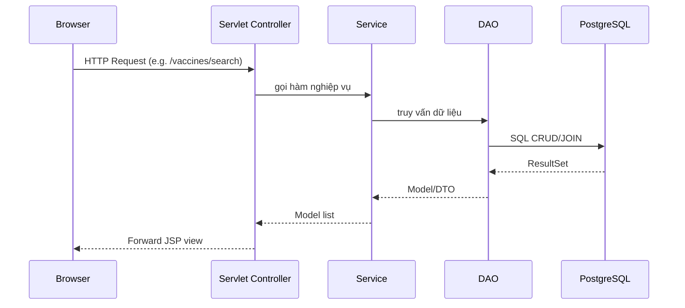

# Bệnh viện - Quản lý vaccine JSP/Servlet

Ứng dụng JSP/Servlet thuần (không Spring) giúp quản lý vaccine, tra cứu lịch sử tiêm và thống kê chi phí cho môn Công Nghệ Web.

## 1. Công nghệ và yêu cầu hệ thống

- Java 8+
- Apache Tomcat 10.1.x (port 8080)
- PostgreSQL (host `127.0.0.1`, port `9696`, db `benhvien_db`, user `admin`, password rỗng)
- Maven 3.9+

## 2. Chuẩn bị cơ sở dữ liệu PostgreSQL

```bash
psql -h 127.0.0.1 -p 9696 -U admin -c "CREATE DATABASE benhvien_db;"
psql -h 127.0.0.1 -p 9696 -d benhvien_db -U admin -f schema.sql   # nếu bạn đã có file schema từ bài lab
psql -h 127.0.0.1 -p 9696 -d benhvien_db -U admin -f schema_update.sql  # Thêm cột ThoiGianCho vào VACXIN
psql -h 127.0.0.1 -p 9696 -d benhvien_db -U admin -f sample_data.sql
```

**Thông tin đăng nhập Admin:**
- Username: `admin`
- Password: `admin`
- ⚠️ **Lưu ý:** Tài khoản admin được hardcode trong code, không lưu trong database

> `sample_data.sql` trong repo đã chuẩn bị sẵn 5 khách hàng, 5 bệnh, 10 vaccine và 10 bản ghi lịch sử.

### Xuất dữ liệu thành `Test999.sql`

```bash
pg_dump -h 127.0.0.1 -p 9696 -U admin -d benhvien_db -f Test999.sql
```

## 3. Build & deploy trên Tomcat 10 (port 8082)

1. Build project: `mvn clean package`
2. Lấy file WAR tại `target/benhvien-web.war`
3. Copy WAR vào `TOMCAT_HOME/webapps`
4. Mở `TOMCAT_HOME/conf/server.xml`, chỉnh Connector chính sang `port="8082"`
5. Khởi động Tomcat: `bin/startup.sh` hoặc từ IDE

Ứng dụng khả dụng tại: `http://localhost:8080/benhvien-web`

## 4. Import vào IntelliJ IDEA / Eclipse

### IntelliJ IDEA
- `File > New > Project from Existing Sources...`
- Chọn thư mục dự án, chọn Maven importer
- Đặt SDK 1.8+, add Tomcat 10 cấu hình port 8082, deploy artifact `benhvien-web:war exploded`

### Eclipse (Enterprise edition)
- `File > Import > Existing Maven Projects`
- Sau khi load, `New > Server > Apache > Tomcat v10.1`
- Set port 8082, add project vào server, Run on Server

## 5. URL mapping chính

| Chức năng | Method | URL | Servlet |
|-----------|--------|-----|---------|
| Danh sách & tìm kiếm vaccine | GET/POST | `/vaccines/search` | `VaccineSearchServlet` |
| Thêm vaccine | GET | `/vaccines/create` | `VaccineCreateServlet` |
| Lưu vaccine | POST | `/vaccines/create` | `VaccineCreateServlet` |
| Sửa vaccine | GET | `/vaccines/edit?maVacxin=...` | `VaccineEditServlet` |
| Cập nhật vaccine | POST | `/vaccines/edit` | `VaccineEditServlet` |
| Xóa vaccine | POST | `/vaccines/delete` | `VaccineDeleteServlet` |
| Tra cứu lịch sử tiêm | GET | `/history` | `LichSuTiemServlet` |
| Thống kê tổng tiền | GET | `/statistics` | `ThongKeServlet` |

## 6. Sơ đồ MVC



## 7. Hướng dẫn sử dụng nhanh

1. Truy cập `http://localhost:8080/benhvien-web` (tự chuyển đến trang vaccine)
2. Tab Vaccine: thêm mới, tìm kiếm theo mã/tên/hãng, sửa, xóa
3. Trang "Lịch sử tiêm": hiển thị join 4 bảng theo yêu cầu đề bài
4. Trang "Thống kê": tính `SUM(GiaVacxin)` theo khách hàng, sắp xếp tăng dần

## 8. Nạp dữ liệu mẫu

- Sau khi tạo schema, chạy `psql ... -f sample_data.sql`
- Cần làm mới (reset) dữ liệu: chạy lại script vì có lệnh `TRUNCATE ... CASCADE`

## 9. Cấu trúc dự án

```
src/
 ├── controller/        # Servlet tầng Controller
 ├── service/           # Interface + impl nghiệp vụ
 ├── dao/               # Interface + impl JDBC
 ├── model/             # POJO entity + DTO
 └── util/DBConnect.java
webapp/
 ├── assets/            # CSS
 ├── WEB-INF/
 │    ├── views/        # JSP (layout + trang)
 │    └── web.xml       # cấu hình servlet
 └── index.jsp          # redirect trang chủ
```

## 10. Kiểm tra nhanh

- `mvn -v` và `java -version` để chắc chắn môi trường OK
- `mvn clean package` -> không lỗi
- Deploy Tomcat 8082 -> mở các URL nêu trên
- Dữ liệu mẫu hiển thị đầy đủ trong 3 trang chính

